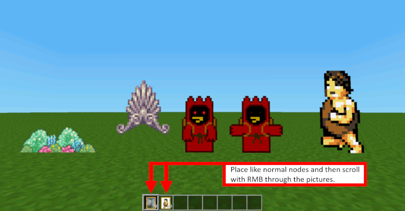

# gemalde

This is a fork of the mod »[gemalde](https://github.com/CasimirKaPazi/gemalde)« from CasimirKaPazi.

This mod adds paintings and animations to Minetest. Search in minetest inventory for »gemalde« and place the node. Then scroll through the images with right mouse button.

You can store your own images in the folder »textures«. The file format must be ».png« and the file names follow the pattern »painted_ContinuousNumber«.

**Changes I made from the original mod:** A new function »after_place« in »still.lua« and »animated.lua« inserted. Now placer of the node is stored and only placer can right-click to scroll through the images.

New file »README« (now »README.md« - this is the file you are currently reading ...).

Additional file »mod.conf« inserted.

licence:
code - GPLv3 or later
pictures - see still.txt and animated.txt
textures - CC BY-SA
